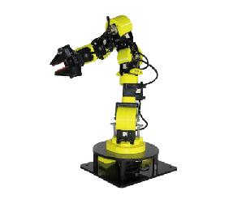

Cute Robot
======
if you don't speak chinese, please [click here](./README_english.md).



本文件夹中包含了多个为Cute机器人提供ROS支持的软件包。推荐的运行环境为 Ubuntu 14.04 及 ROS Indigo，其他环境下的运行情况没有测试过。

### 安装软件包

**安装一些重要的依赖包**
```sh
$ sudo apt-get install ros-indigo-dynamixel-motor ros-indigo-gazebo-ros-control
```
**安装和升级MoveIt!,** 注意因为MoveIt!最新版进行了很多的优化，如果你已经安装了MoveIt!, 也请一定按照以下方法升级到最新版。

安装MoveIt!：
```sh
$ sudo apt-get install ros-indigo-moveit
$ sudo apt-get install ros-indigo-moveit-full-pr2
$ sudo apt-get install ros-indigo-moveit-kinematics
$ sudo apt-get install ros-indigo-moveit-ros-move-group
```
升级MoveIt!:
```sh
$ sudo apt-get update
$ sudo apt-get upgrade
$ sudo apt-get install ros-indigo-moveit-kinematics
$ sudo apt-get install ros-indigo-moveit-ros-move-group
```
**安装本软件包**

首先创建catkin工作空间 ([教程](http://wiki.ros.org/catkin/Tutorials))。 然后将本文件夹克隆到src/目录下，之后用catkin_make来编译。  
假设你的工作空间是~/catkin_ws，你需要运行的命令如下：
```sh
$ cd ~/catkin_ws/src
$ git clone https://github.com/hans-robot/cute_robot.git
$ cd ..
$ catkin_make
$ source devel/setup.bash
```

---

### 使用仿真模型

用Gazebo仿真请运行：
```sh
$ roslaunch cute_model gazebo.launch
```
运行MoveIt!模块和RViz界面:
```sh
$ roslaunch cute_moveit_config moveit_planning_execution.launch
```
> 关于MoveIt!的使用方法可以参考[docs/moveit_plugin_tutorial.md](docs/moveit_plugin_tutorial.md)  
Tips:  
每次规划路径时，都要设置初始位置为当前位置。

打开以下程序用键盘操作模型：
```sh
$ rosrun cute_teleop cute_teleop_keyboard
```
运行以下程序开启手柄遥控功能：
```sh
$ roslaunch cute_moveit_config joystick_control.launch
```
> 关于手柄遥控的使用方法可以参考下面的链接：  
http://docs.ros.org/indigo/api/moveit_tutorials/html/doc/ros_visualization/joystick.html  
Tips:  
> 1. In the Motion Planning plugin of Rviz, enable “Allow External Comm.” checkbox in the “Planning” tab.  
> 2. Add “Pose” to rviz Displays and subscribe to /joy_pose in order to see the output from joystick. Note that only planning groups that have IK solvers for all their End Effector parent groups will work.

更多关于API的信息请看[docs/API_description.md](docs/API_description.md)

---

### 使用真实的Cute机器人
将Cute通过USB线连接到电脑。用以下命令可以查到当前电脑连接的USB设备的编号：
```sh
$ ls /dev/ttyUSB*
```
如果有多个设备的话，可以先在不连Cute的情况下确定其他设备的编号，再插入Cute连接线，这样新增加的设备编号就是Cute的了。本软件包默认的编号是/dev/ttyUSB0 。假如当前编号不是0的话，请对cute_bringup/launch/cute_bringup.launch的相应部分进行修改。
```
        port_name: "/dev/ttyUSB0"
```
根据Cute所搭载的舵机型号对启动文件的相应部分进行修改。  
cute_bringup/launch/cute_bringup.launch：
```xml
    <!-- There are 3 options for servo: dynamixel, xqtor_0, xqtor_1 -->
    <!-- xqtor_0: the early version of the xQtor servo before 2017-->
    <!-- xqtor_1: the new version of the xQtor servo -->
    <arg name="servo" default="xqtor_1"/>
```

现假设设备编号是/dev/ttyUSB0，运行以下指令来启动驱动：
```sh
$ sudo chmod 777 /dev/ttyUSB0
$ roslaunch cute_bringup cute_bringup.launch
```

令机械臂回到起始位姿：
```sh
$ rosservice call /cute_go_home "data: true"
```
在上行命令中，“data: false" 和 ”data: true" 的效果是一样的。

运行MoveIt!模块和RViz界面:
```sh
$ roslaunch cute_moveit_config moveit_planning_execution.launch
```
> 关于MoveIt!的使用方法可以参考[docs/moveit_plugin_tutorial.md](docs/moveit_plugin_tutorial.md)  
Tips:  
每次规划路径时，都要设置初始位置为当前位置。

如果你此时不想运行RViz界面，请用以下命令：
```sh
$ roslaunch cute_moveit_config moveit_planning_execution.launch display:=false
```

打开以下程序用键盘操作机械臂：
```sh
$ rosrun cute_teleop cute_teleop_keyboard
```
运行以下程序开启手柄遥控功能：
```sh
$ roslaunch cute_moveit_config joystick_control.launch
```
> 关于手柄遥控的使用方法可以参考下面的链接：  
http://docs.ros.org/indigo/api/moveit_tutorials/html/doc/ros_visualization/joystick.html  
Tips:  
> 1. In the Motion Planning plugin of Rviz, enable “Allow External Comm.” checkbox in the “Planning” tab.   
> 2. Add “Pose” to rviz Displays and subscribe to /joy_pose in order to see the output from joystick. Note that only planning groups that have IK solvers for all their End Effector parent groups will work.

在关闭机械臂电源前，先运行以下命令可让机械臂提前去使能，此时请用手保护好机械臂，以防它失力后掉下来。
```sh
$ rosservice call /cute_torque_enable "data: false" 
```
注意，在上行命令中，“data: false" 和 ”data: true" 的效果是不一样的。“data: false"可让机械臂去使能。与之相反，“data: true"可让机械臂使能。

控制夹爪前也需将其使能
```sh
$ rosservice call /claw_controller/torque_enable "torque_enable: true"
```

更多关于API的信息请看[docs/API_description.md](docs/API_description.md)
